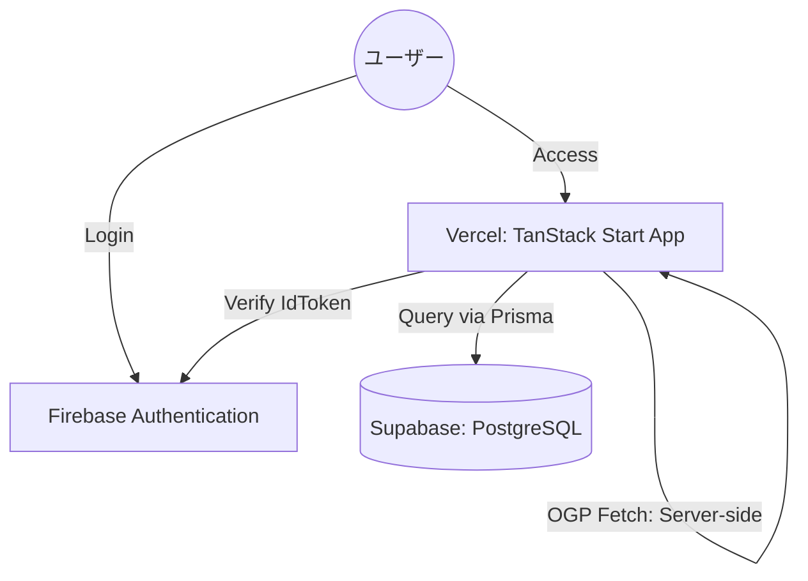

# 家族間アカウント管理アプリ「PoohMa」詳細設計書

**プロジェクト:** PoohMa (プーマ)
**バージョン:** 1.1.0
**プラットフォーム:** Vercel (ホスティング) + Supabase (PostgreSQL)
**フレームワーク:** TanStack Start (Vite / Nitro)

---

## 1. システムアーキテクチャ

TanStack Start によるサーバー・クライアント統合環境を基盤とし、Vercel上にデプロイする。データベースはSupabase (PostgreSQL) を利用する。

### 1.1 インフラ構成図



### 1.2 技術スタック

| レイヤー | 技術 |
| :--- | :--- |
| **フロントエンド** | React 19, TanStack Router, Tailwind CSS v4 |
| **バックエンド** | TanStack Start Server Functions (Nitro) |
| **ORM** | Prisma v7 (`@prisma/client`, `@prisma/adapter-pg`) |
| **認証** | Firebase Authentication (Client SDK + Admin SDK) |
| **データベース** | PostgreSQL (Supabase) |
| **ホスティング** | Vercel |
| **フォント** | `@fontsource/geist-sans`, `@fontsource/geist-mono` |
| **Lint/Format** | Biome |
| **型チェック** | `@typescript/native-preview` (tsgo) |
| **テスト** | Vitest |
| **CI** | GitHub Actions |

---

## 2. データベース設計 (Supabase / PostgreSQL)

### 2.1 テーブル定義

#### families (家族グループ)

| カラム名 | 型 | 制約 | 説明 |
| :--- | :--- | :--- | :--- |
| id | uuid | PK, default: gen_random_uuid() | 家族ID（招待コードとしても使用） |
| name | varchar(100) | NOT NULL | 家族名 |
| encrypted_master_key | text | | パスコードで暗号化されたMasterKey |
| master_key_salt | varchar(255) | | パスコード導出用ソルト |
| master_key_iv | varchar(255) | | MasterKey暗号化用IV |
| created_at | timestamptz | default: now() | 作成日 |
| updated_at | timestamptz | auto | 更新日 |

#### users (ユーザープロフィール)

| カラム名 | 型 | 制約 | 説明 |
| :--- | :--- | :--- | :--- |
| id | varchar(128) | PK (Firebase UID) | ユーザーID |
| email | varchar(255) | NOT NULL, UNIQUE | メールアドレス |
| family_id | uuid | FK (families.id), NULL可能 | 所属家族ID |
| display_name | varchar(100) | | 表示名 |
| created_at | timestamptz | default: now() | 作成日 |
| updated_at | timestamptz | auto | 更新日 |

#### service_records (サービスレコード)

| カラム名 | 型 | 制約 | 説明 |
| :--- | :--- | :--- | :--- |
| id | uuid | PK, default: gen_random_uuid() | レコードID |
| user_id | varchar(128) | FK (users.id), NOT NULL | 作成者ID |
| family_id | uuid | FK (families.id), NULL可能 | 共有用家族ID |
| title | varchar(255) | NOT NULL | サービス名 |
| url | text | | URL |
| ogp_image_url | text | | OGP画像URL |
| ogp_description | text | | OGP説明文 |
| memo | text | | 自由記述メモ |
| visibility | Enum (PRIVATE, SHARED) | default: PRIVATE | 公開設定 |
| created_at | timestamptz | default: now() | 作成日 |
| updated_at | timestamptz | auto | 最終更新日 |

**インデックス:**

- `@@index([userId])`
- `@@index([familyId, visibility])`

#### account_credentials (ID/ヒント)

| カラム名 | 型 | 制約 | 説明 |
| :--- | :--- | :--- | :--- |
| id | uuid | PK | ID |
| record_id | uuid | FK (service_records.id) ON DELETE CASCADE | 親レコードID |
| label | varchar(100) | | 例: パパ用 |
| login_id | varchar(255) | | ログインID |
| encrypted_hint | text | | 暗号化されたパスワードヒント |
| hint_iv | varchar(255) | | ヒント暗号化用IV |
| created_at | timestamptz | default: now() | 作成日 |
| updated_at | timestamptz | auto | 更新日 |

#### record_tags (レコードタグ)

| カラム名 | 型 | 制約 | 説明 |
| :--- | :--- | :--- | :--- |
| id | uuid | PK | ID |
| record_id | uuid | FK (service_records.id) ON DELETE CASCADE | 親レコードID |
| tag_name | varchar(50) | NOT NULL | タグ名 |

**制約:**

- `@@unique([recordId, tagName])` — 同一レコード内でのタグ名重複を防止
- `@@index([tagName])` — タグ名での検索・集計用

---

## 3. アプリケーション設計 (TanStack Start)

### 3.1 ルーティング (File-based Routing)

| パス | ファイル | 役割 |
| :--- | :--- | :--- |
| — | `src/routes/__root.tsx` | ルートレイアウト、Auth状態管理、エラーハンドリング、404ページ |
| `/` | `src/routes/index.tsx` | ランディングページ（ログイン済みの場合はダッシュボードへリダイレクト） |
| `/login` | `src/routes/login.tsx` | Firebase Auth ログイン処理（Google認証） |
| `/dashboard` | `src/routes/(app)/dashboard.tsx` | サービス一覧、テキスト検索、タグクラウドフィルター |
| `/records/new` | `src/routes/(app)/records/new.tsx` | レコード新規作成フォーム |
| `/records/$id` | `src/routes/(app)/records/$id.tsx` | レコード詳細表示・インライン編集・削除 |
| `/family` | `src/routes/(app)/family.tsx` | 家族管理（作成・参加・メンバー表示） |

`(app)` はルートグループで、認証済みユーザー用のレイアウト（`route.tsx`）を共有する。

### 3.2 サーバー関数 (Server Functions)

`createServerFn` を使用し、クライアントから型安全にサーバーロジックを呼び出す。全関数で `getAuthUser()` による認証チェックを冒頭で実施する。

#### レコード操作 (`src/services/records.functions.ts`)

| 関数名 | HTTPメソッド | 説明 |
| :--- | :--- | :--- |
| `getRecords` | GET | 閲覧可能なレコード一覧取得。テキスト検索 (`q`) とタグフィルター (`tag`) に対応。 |
| `getRecordDetail` | GET | レコード詳細取得。権限チェック付き。 |
| `createRecord` | POST | レコード新規作成。トランザクション内で関連データ（Credential, Tag）を一括保存。 |
| `updateRecord` | POST | レコード更新。トランザクション内で関連データを再構築。 |
| `deleteRecord` | POST | レコード削除。Cascade設定により関連データも自動削除。 |
| `getOgpInfoFn` | GET | 指定URLのHTMLから `og:title`, `og:image`, `og:description` を正規表現で抽出。 |
| `getAvailableTagsFn` | GET | ユーザーが閲覧可能なレコードに紐づくタグの重複排除一覧を取得。 |
| `exportRecordsCsv` | GET | 閲覧可能な全データをCSV形式で取得。 |
| `importRecordsCsv` | POST | CSVデータを受け取り、バリデーション後に一括登録。 |

#### 認証 (`src/services/auth.functions.ts`)

| 関数名 | 説明 |
| :--- | :--- |
| `getAuthUser` | Cookie内のFirebase IDトークンを検証し、対応するDBユーザーを返す。 |

#### 家族管理 (`src/services/family.functions.ts`)

| 関数名 | 説明 |
| :--- | :--- |
| `createFamilyFn` | 新しい家族グループを作成し、作成者を所属させる。 |
| `joinFamilyFn` | 招待コード（家族ID）で既存の家族に参加する。 |
| `getFamilyMembersFn` | 所属する家族のメンバー一覧を取得する。 |
| `rotateFamilyPasscode` | 古いパスコードでMasterKeyを復号し、新しいパスコードで再暗号化して保存する。 |

### 3.3 データ取得と状態管理

- **Loaders**: ページ遷移時に `loader` で必要なデータを事前取得。TanStack Router の SPA遷移でスクロール位置を保持。
- **Search Params**: ダッシュボードのタグフィルタリング状態（例: `?tag=動画`）と検索ワード（例: `?q=Netflix`）をURLと同期。`z.object` による型安全なパース。
- **History Back**: 詳細画面からの「戻る」操作で `window.history.back()` を使用し、フィルター状態とスクロール位置を復元する。

---

## 4. ロジック設計

### 4.1 OGP取得処理

1. ユーザーがURL入力フォームからフォーカスを外す（Blur）。
2. クライアントから `getOgpInfoFn` を呼び出す。
3. サーバーサイドで対象URLのHTMLを `fetch` で取得し、正規表現で `og:title`、`og:image`、`og:description` を抽出する。
4. OGP情報をJSONで受け取り、UI（タイトル、画像プレビュー、説明文）を即時更新する。

### 4.2 権限検証 (Application Layer)

サーバー関数内で以下のチェックを実施する。

- **閲覧・編集・削除時:**

```ts
const isOwner = record.userId === user.id;
const isFamilyShared =
  record.visibility === Visibility.SHARED &&
  record.familyId === user.familyId;
if (!isOwner && !isFamilyShared) {
  throw new Error("Forbidden");
}
```

### 4.3 レコード更新のトランザクション処理

`updateRecord` では、関連テーブル（`AccountCredential`, `RecordTag`）を一度削除してから再作成する「Delete & Recreate」パターンを採用する。Prismaの `$transaction` 内で実行し、整合性を保証する。

### 4.4 クライアントサイドE2E暗号化 (E2EE)

1. **鍵導出 (PBKDF2):** ユーザーが入力した `FamilyPasscode` と DB上の `master_key_salt` を使い、ストレッチングを行って暗号鍵を導出。
2. **MasterKeyの復号:** 導出した鍵で `encrypted_master_key` を復号し、メモリ上に保持する（`PasscodeProvider` / React Context）。
3. **データの暗号化・復号 (AES-GCM):**
   - 保存時: メモリ上の `MasterKey` を使用して `passwordHint` を暗号化し、暗号文と `iv` をサーバーへ送信。
   - 取得時: サーバーから届いた暗号文と `iv` を `MasterKey` で復号して表示。
4. **パスコード変更 (Rotation):**
   - クライアント側で「旧パスコード」と「新パスコード」を入力。
   - 旧パスコードで `MasterKey` を復号し、新パスコードで再暗号化。
   - サーバー側では `MasterKey` そのものは変更せず、暗号化された外殻のみを更新するため、個別レコードの再暗号化は不要。

---

## 5. セキュリティ・認証

### 5.1 認証フロー

- **クライアント側**: Firebase SDK を使用してGoogle認証を実行し、IDトークンをCookieに保存。
- **サーバー側**: リクエストごとにCookieからIDトークンを取得し、`firebase-admin` を用いて検証。検証後、対応するDBユーザーのレコードを返却する。

### 5.2 Firebase Custom Claims

ユーザーが家族に参加した際、Firebase Admin SDKを用いてIDトークンのカスタムクレームに `family_id` を埋め込む処理を `createFamilyFn` / `joinFamilyFn` 内で実施する。

---

## 6. インフラ・デプロイ

### 6.1 ホスティング (Vercel)

- **Build Command**: `npx prisma generate && npx prisma migrate deploy && pnpm run build`
- **Install Command**: `pnpm install --frozen-lockfile`
- **環境変数**: `DATABASE_URL`, Firebase Admin認証情報, Firebase Client設定

### 6.2 データベース (Supabase)

- Supabase PostgreSQL のTransaction poolerを利用し、Prisma経由で接続する。
- マイグレーションはVercelのビルドプロセスで `prisma migrate deploy` により自動実行する。

### 6.3 CI/CD

- **GitHub Actions** (`.github/workflows/ci.yml`):
  - `main` ブランチへのPush / PRで自動実行。
  - `pnpm install --frozen-lockfile` → `biome check` → `tsgo --noEmit` → `vitest run`
- **Vercel for GitHub**:
  - `main` へのマージでProduction自動デプロイ。
  - PRでPreview環境の自動デプロイ。

### 6.4 デザインシステム

- Vercel Geist デザインシステム準拠（詳細は `.docs/DESIGN.md` を参照）。
- アクセントカラー: オレンジ (`orange-500`)。
- Shadow-as-border: `box-shadow: 0px 0px 0px 1px rgba(0,0,0,0.08)` で従来のborderを代替。
- カスタムユーティリティクラス: `shadow-card`, `shadow-card-hover`, `shadow-border`, `shadow-border-light`, `tracking-geist-*`。
