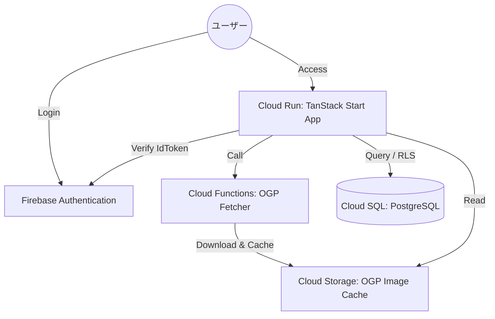

# 家族間アカウント管理アプリ「PoohMa」詳細設計書

**プロジェクト:** PoohMa (プーマ)
**バージョン:** 1.0.0
**プラットフォーム:** GCP (Cloud Run, Cloud SQL, Cloud Functions)
**フレームワーク:** TanStack Start (Vite / Vinxi)

---

## 1. システムアーキテクチャ

TanStack Start によるサーバー・クライアント統合環境を基盤とし、GCPの各マネージドサービスと疎結合に連携する。

### 1.1 インフラ構成図



---

## 2. データベース設計 (Cloud SQL / PostgreSQL)

### 2.1 テーブル定義

#### families (家族グループ)

| カラム名 | 型 | 制約 | 説明 |
| :--- | :--- | :--- | :--- |
| id | uuid | PK, default: gen_random_uuid() | 家族ID |
| name | varchar(100) | NOT NULL | 家族名 |
| created_at | timestamptz | default: now() | 作成日 |

#### users (ユーザープロフィール)

| カラム名 | 型 | 制約 | 説明 |
| :--- | :--- | :--- | :--- |
| id | varchar(128) | PK (Firebase UID) | ユーザーID |
| email | varchar(255) | NOT NULL, UNIQUE | メールアドレス |
| family_id | uuid | FK (families.id), NULL可能 | 所属家族ID |
| display_name | varchar(100) | | 表示名 |

#### service_records (サービスレコード)

| カラム名 | 型 | 制約 | 説明 |
| :--- | :--- | :--- | :--- |
| id | uuid | PK, default: gen_random_uuid() | レコードID |
| user_id | varchar(128) | FK (users.id), NOT NULL | 作成者ID |
| family_id | uuid | FK (families.id), NULL可能 | 共有用家族ID |
| title | varchar(255) | NOT NULL | サービス名 |
| url | text | | URL |
| ogp_image_url | text | | OGP画像URL (Storageパス) |
| visibility | varchar(20) | CHECK ('Private', 'Shared') | 公開設定 |
| updated_at | timestamptz | default: now() | 最終更新日 |

#### account_credentials (ID/ヒント)

| カラム名 | 型 | 制約 | 説明 |
| :--- | :--- | :--- | :--- |
| id | uuid | PK | ID |
| record_id | uuid | FK (service_records.id) ON DELETE CASCADE | 親レコードID |
| label | varchar(100) | | 例: パパ用 |
| login_id | varchar(255) | | ログインID |
| password_hint | text | | パスワードのヒント |

#### tags (レコードタグ)

| カラム名 | 型 | 制約 | 説明 |
| :--- | :--- | :--- | :--- |
| id | uuid | PK | ID |
| record_id | uuid | FK (service_records.id) ON DELETE CASCADE | 親レコードID |
| tag_name | varchar(50) | NOT NULL | タグ名 |

---

## 3. アプリケーション設計 (TanStack Start)

### 3.1 ルーティング (File-based Routing)

* `app/routes/__root.tsx`: レイアウト、グローバルナビゲーション、Auth状態管理。
* `app/routes/index.tsx`: ダッシュボード。`searchParams` によるタグ検索状態の管理。
* `app/routes/records.$id.tsx`: レコード詳細・編集。`loader` による型安全なデータ取得。
* `app/routes/login.tsx`: Firebase Auth ログイン処理。

### 3.2 サーバー関数 (Server Functions)

`createServerFn` を使用し、クライアントから型安全にサーバーロジックを呼び出す。

* **`getRecordsFn`**: 閲覧可能なレコードをDBから取得。
* **`saveRecordFn`**: レコードの作成・更新。Sharedレコードの場合は家族の編集権限を検証。
* **`getOgpInfoFn`**: 外部の Cloud Functions を呼び出し OGP 情報を取得。
* **`getAvailableTagsFn`**: ユーザーが閲覧可能なレコードに基づき、タグのユニーク一覧を集計。

### 3.3 データ取得と状態管理

* **Loaders**: ページ遷移時に必要なデータを事前取得し、ローディング状態を TanStack Router で制御。
* **Search Params**: ダッシュボードのタグフィルタリング状態（例: `?tag=動画&tag=サブスク`）をURLと同期。

---

## 4. ロジック設計

### 4.1 OGP取得処理

1. ユーザーがURL入力フォームからフォーカスを外す（Blur）。
2. クライアントから `getOgpInfoFn` を呼び出す。
3. サーバー側から Cloud Functions (`ogp-fetcher`) を呼び出す。
4. OGP情報をJSONで受け取り、UI（タイトル、画像プレビュー）を即時更新する。

### 4.2 権限検証 (Row Level Security & Logic)

DBレベルでのRLSに加え、アプリケーション層で以下のチェックを行う。

* **Sharedレコードの編集**:

```ts
const isOwner = record.user_id === auth.uid;
const isFamilyMember = record.visibility === 'Shared' && record.family_id === auth.family_id;
if (isOwner || isFamilyMember) { /*編集許可*/ }
```

---

## 5. セキュリティ・認証

### 5.1 認証フロー

* **クライアント側**: Firebase SDK を使用してソーシャルログイン/メールログインを実行。
* **サーバー側**: リクエストごとに IDトークンを `Authorization` ヘッダーで受領。`firebase-admin` を用いて検証し、セッション変数をセット。

### 5.2 Firebase Custom Claims

ユーザーの `family_id` をトークンのカスタムクレームに埋め込むことで、DB参照なしに所属グループの判定を可能にする。

---

## 6. インフラ・デプロイ

### 6.1 デプロイメント

* **Cloud Build**: `Dockerfile` を用いて Vinxi (TanStack Start) のビルド済みイメージを作成。Artifact Registry へ保存。
* **Cloud Run**: 保存されたイメージを起動。VPC Connector を通じて Cloud SQL へ接続。

### 6.2 監視

* **Cloud Logging**: サーバーエラーおよび OGP 取得失敗ログの追跡。
* **Error Reporting**: 本番環境でのランタイムエラーの自動検知。
